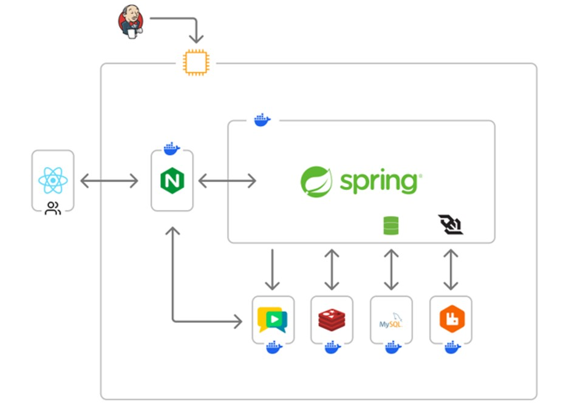
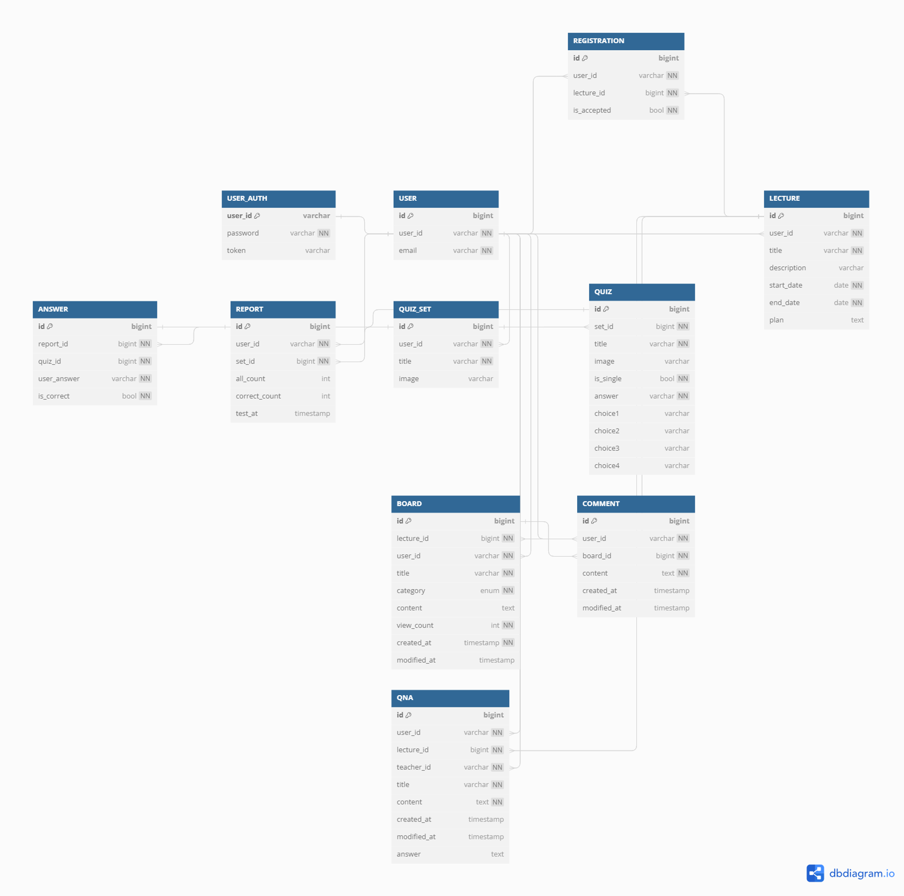

# EduFocus
## 비대면 강의를 위한 통합 온라인 교육 플랫폼 EduFocus

## 💡 기능 소개
### 💻 실시간 온라인 강의
- 실시간 온라인 강의 서비스 제공
- 강사 사용자가 자신이 개설한 과목의 온라인 강의 시작, 종료
- 학생 사용자는 자신이 수강중인 과목의 온라인 강의 참여
- 온라인 강의 중 화면공유, 채팅 서비스 제공

### ❓ 강의에 더 집중할 수 있는 퀴즈!
- 강의 중 사전에 만들어둔 퀴즈 실시 가능
- 별도의 제출버튼 없이 제한시간(10초) 경과시 자동 제출

### 📑 퀴즈 결과로 보는 나의 강·약점!
- 퀴즈 종료 이후 마이페이지에서 결과 확인
- 자신의 맞은 문제, 틀린 문제, 정답률 확인을 통해 강·약점 확인

### 🙋‍♂️ 이해가 안되는 부분은 질문으로
- 자유게시판, 질문게시판을 통해 강사-학생간 소통, 문의사항, 질문 해결

## 📂 시스템 아키텍처

## 💻 Stacks

### Frontend

### Backend

### Infra

### ETC

## ERD

## 시연영상

## 팀원 소개
|박정민|김기창|김한얼|정기영|조민우|조현수|
|:-------:|:-------:|:-------:|:-------:|:-------:|:-------:|
|Backend / Infra|Backend|Backend|Frontend|Frontend|Frontend / Infra|
|[inmyownway](https://github.com/inmyownway)|[kgc9007](https://github.com/kgc9007)|[yulmam](https://github.com/yulmam)|[FlashingFuture](https://github.com/FlashingFuture)|[mauercho](https://github.com/mauercho)|[jhynsoo](https://github.com/jhynsoo)|
|||||||